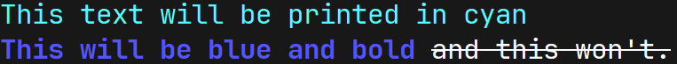
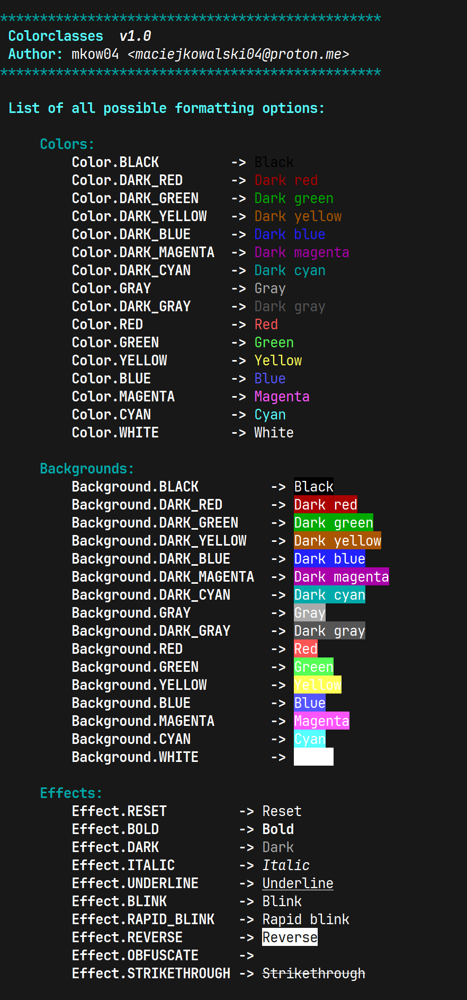

# Colorclasses v1.0
#### Library providing classes for easier text coloring in python using ANSI escape codes

## Usage

Colorclasses library makes use of Enums for mapping of ANSI codes to color names.

```python
# Importing the classes provided by the library:
from colorclasses import Color, Background, Effect

# The formatting options can be used within an fstring.
# It's good practice to use Effect.RESET at the end of each line,
# so the formatting doesn't affect the next line.

print(f"{Color.CYAN}This text will be printed in cyan{Effect.RESET}")
print(f"{Color.BLUE}{Effect.BOLD}This will be blue and bold {Effect.RESET}{Effect.STRIKETHROUGH}and this won't.{Effect.RESET}")
```
#### Output:


## Interactive run
```bash
python3 colorclasses.py
```
#### Output:

